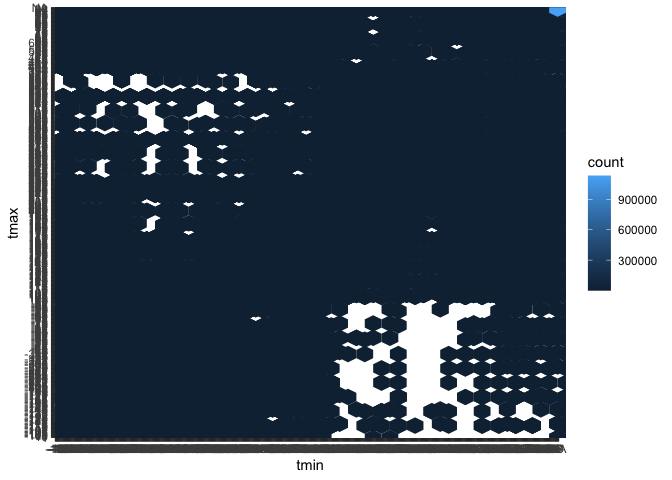

p8105_hw3_mh4589
================
My An Huynh
2024-10-04

``` r
ny_noaa_df <- ny_noaa |> 
  separate(date, into = c("year", "month", "day"), sep = "-")

snow_mode =
  ny_noaa_df |> 
  count(snow, name = "frequency") |> 
  arrange(desc(frequency)) |> 
  slice(1)
```

The dataset NY NOAA provies information on temperature, snowfall, snow
depth and precipitation everyday starting from 1981 at different weather
stations in NY. Most of the data values came back

There are `nrow(ny_noaa)` rows and `ncol(ny_noaa)` columns. The most
common snowfall is 0. This is because snow is commonly observed on
certain days during winter months, but not the rest of the year. Make a
two-panel plot showing the average max temperature in January and in
July in each station across years.

``` r
ny_noaa_df |> 
  drop_na(tmax, tmin) |> 
  filter(month == c("01", "07")) |>
  group_by(id, year) |> 
  mutate(
    tmax = as.numeric(tmax),
    tmin = as.numeric(tmin),
    tmax = tmax/10,
    tmin = tmin/10,
    mean_tmax = mean(tmax, na.rm = TRUE)
  ) |> 
  ggplot(aes(x = id, y = mean_tmax, color = year)) + 
  geom_point(aes(group = year), alpha = 0.5) +
  facet_grid(~month) +
  labs(
    title = "Mean Maximum Temperature Across Stations in January and July",
    x = "Station",
    y = "Mean Maximum Temperature (C)"
) +
  theme_minimal()
```

<!-- -->

``` r
ny_noaa_df |> 
  filter(snow > 0, snow < 100) |> 
  ggplot(aes(x = tmax, y = tmin)) 
```

<!-- -->

## Problem 2

Load, tidy, merge and organize the acceleration and demographic
datasets.

``` r
accel_df =
  read_csv("data/nhanes_accel.csv") |> 
  janitor::clean_names()
```

    ## Rows: 250 Columns: 1441
    ## ── Column specification ────────────────────────────────────────────────────────
    ## Delimiter: ","
    ## dbl (1441): SEQN, min1, min2, min3, min4, min5, min6, min7, min8, min9, min1...
    ## 
    ## ℹ Use `spec()` to retrieve the full column specification for this data.
    ## ℹ Specify the column types or set `show_col_types = FALSE` to quiet this message.

``` r
covar_df = 
  read_csv("data/nhanes_covar.csv", skip = 4) |> 
  janitor::clean_names() |> 
  mutate(
    sex = factor(sex),
    education = factor(education)
  )
```

    ## Rows: 250 Columns: 5
    ## ── Column specification ────────────────────────────────────────────────────────
    ## Delimiter: ","
    ## dbl (5): SEQN, sex, age, BMI, education
    ## 
    ## ℹ Use `spec()` to retrieve the full column specification for this data.
    ## ℹ Specify the column types or set `show_col_types = FALSE` to quiet this message.

``` r
nhanes_df = 
  left_join(covar_df, accel_df, by = "seqn") |> 
  filter(age > 21) |> 
  drop_na(education, bmi, age, sex)
```

Created a reader-friendly table using `kable()` showing teh number of
men and women in each education category, and created a boxplot showing
the dsitribution of age for men and women across each education
category. For the table, category 3 in education has the most
participants. There are more male participants whose education is in
category 2 compared to female.

``` r
nhanes_df |> 
  group_by(education, sex) |> 
  summarize(
    count = n()
  ) |> 
  pivot_wider(
    names_from = education,
    values_from = count
  ) |> 
  knitr::kable(
    caption = "Number of men and women in each education category"
  ) 
```

    ## `summarise()` has grouped output by 'education'. You can override using the
    ## `.groups` argument.

| sex |   1 |   2 |   3 |
|:----|----:|----:|----:|
| 1   |  27 |  34 |  54 |
| 2   |  28 |  23 |  59 |

Number of men and women in each education category

``` r
nhanes_df |> 
  ggplot(aes(x = education, y = age, fill = sex)) + 
  geom_boxplot() +
  labs(
    title = "Distribution of Age by Sex and Education",
    x = "Education Category",
    y = "Age"
  ) +
  theme_minimal()
```

<!-- -->

Created a new `total_activity` variable that aggregates activity level
across 1440 minutes for each participant. Made a plot of total activity
against age and included a trend line. The overall trend indicates that
there is less activity as age increases for all participants, male and
female and across 3 education groups. For education groups

``` r
nhanes_df |> 
  mutate(
    total_activity = rowSums(across(min1:min1440), na.rm = TRUE)
  ) |> 
  ggplot(aes(x = age, y = total_activity, color = sex))+
  geom_point(alpha = 0.5)+
  geom_smooth(se = TRUE) +
  facet_grid(~education) + 
  labs(
    title = "Total Activity vs Age across Sex and Education Level",
    x = "Age (years)",
    y = "Total Activity"
  )
```

    ## `geom_smooth()` using method = 'loess' and formula = 'y ~ x'

<!-- -->
