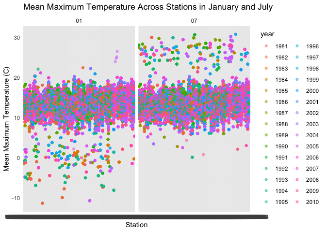

p8105_hw3_mh4589
================
My An Huynh
2024-10-04

``` r
ny_noaa_df <- ny_noaa |> 
  separate(date, into = c("year", "month", "day"), sep = "-")

snow_mode =
  ny_noaa_df |> 
  count(snow, name = "frequency") |> 
  arrange(desc(frequency)) |> 
  slice(1)
```

The dataset NY NOAA provies information on temperature, snowfall, snow
depth and precipitation everyday starting from 1981 at different weather
stations in NY. Most of the data values came back

There are 2595176 rows and 7 columns. The most common snowfall is 0.
This is because snow is commonly observed on certain days during winter
months, but not the rest of the year. Make a two-panel plot showing the
average max temperature in January and in July in each station across
years.

``` r
ny_noaa_df |> 
  drop_na(tmax, tmin) |> 
  filter(month == c("01", "07")) |>
  group_by(id, year) |> 
  mutate(
    tmax = as.numeric(tmax),
    tmin = as.numeric(tmin),
    tmax = tmax/10,
    tmin = tmin/10,
    mean_tmax = mean(tmax, na.rm = TRUE)
  ) |> 
  ggplot(aes(x = id, y = mean_tmax, color = year)) + 
  geom_point(aes(group = year), alpha = 0.5) +
  facet_grid(~month) +
  labs(
    title = "Mean Maximum Temperature Across Stations in January and July",
    x = "Station",
    y = "Mean Maximum Temperature (C)"
) +
  theme_minimal()
```

<!-- -->

Hex plot showing tmax vs tmin

``` r
ny_noaa_df |> 
  ggplot(aes(x = tmin, y = tmax)) +
  geom_hex()
```

<!-- -->

Disrtibution of snow by year

``` r
ny_noaa_df |> 
  filter(snow > 0, snow < 100) |> 
  ggplot(aes(x = snow, y = factor(year))) +
  geom_density_ridges() +
  labs(
    title = "Disribution of snow by year"
  )
```

    ## Picking joint bandwidth of 3.76

<!-- -->

## Problem 2

Load, tidy, merge and organize the acceleration and demographic
datasets. Chagne education to 1. less than high school, 2 is high school
equivalent, 3 is more than high school. Make a boxplot as the first
figure

``` r
accel_df =
  read_csv("data/nhanes_accel.csv") |> 
  janitor::clean_names()
```

    ## Rows: 250 Columns: 1441
    ## ── Column specification ────────────────────────────────────────────────────────
    ## Delimiter: ","
    ## dbl (1441): SEQN, min1, min2, min3, min4, min5, min6, min7, min8, min9, min1...
    ## 
    ## ℹ Use `spec()` to retrieve the full column specification for this data.
    ## ℹ Specify the column types or set `show_col_types = FALSE` to quiet this message.

``` r
covar_df = 
  read_csv("data/nhanes_covar.csv", skip = 4) |> 
  janitor::clean_names() |> 
  mutate(
    sex = recode(sex, 
                 "1" = "male", 
                 "2" = "female"),
    sex = factor(sex, levels = c("male", "female")),
    education = recode(education,
                       "1" = "Less than high school",
                       "2" = "High school equivalent",
                       "3" = "More than high school"),
    education = factor(education, levels = c("Less than high school", "High school equivalent", "More than high school"))
  )
```

    ## Rows: 250 Columns: 5
    ## ── Column specification ────────────────────────────────────────────────────────
    ## Delimiter: ","
    ## dbl (5): SEQN, sex, age, BMI, education
    ## 
    ## ℹ Use `spec()` to retrieve the full column specification for this data.
    ## ℹ Specify the column types or set `show_col_types = FALSE` to quiet this message.

``` r
nhanes_df = 
  left_join(covar_df, accel_df, by = "seqn") |> 
  filter(age > 21) |> 
  drop_na(education, bmi, age, sex)
```

Created a reader-friendly table using `kable()` showing teh number of
men and women in each education category, and created a boxplot showing
the dsitribution of age for men and women across each education
category. For the table, category 3 in education has the most
participants. There are more male participants whose education is in
category 2 compared to female.

``` r
nhanes_df |> 
  group_by(education, sex) |> 
  summarize(
    count = n()
  ) |> 
  pivot_wider(
    names_from = education,
    values_from = count
  ) |> 
  knitr::kable(
    caption = "Number of men and women in each education category"
  ) 
```

    ## `summarise()` has grouped output by 'education'. You can override using the
    ## `.groups` argument.

| sex    | Less than high school | High school equivalent | More than high school |
|:-------|----------------------:|-----------------------:|----------------------:|
| male   |                    27 |                     34 |                    54 |
| female |                    28 |                     23 |                    59 |

Number of men and women in each education category

``` r
nhanes_df |> 
  ggplot(aes(x = age, fill = sex)) + 
  geom_density(alpha = 0.5) +
  facet_grid(. ~ education) +
  labs(
    title = "Distribution of Age by Sex and Education",
    x = "Age",
    y = "Density"
  ) 
```

<!-- -->

``` r
  theme_minimal()
```

    ## List of 136
    ##  $ line                            :List of 6
    ##   ..$ colour       : chr "black"
    ##   ..$ linewidth    : num 0.5
    ##   ..$ linetype     : num 1
    ##   ..$ lineend      : chr "butt"
    ##   ..$ arrow        : logi FALSE
    ##   ..$ inherit.blank: logi TRUE
    ##   ..- attr(*, "class")= chr [1:2] "element_line" "element"
    ##  $ rect                            :List of 5
    ##   ..$ fill         : chr "white"
    ##   ..$ colour       : chr "black"
    ##   ..$ linewidth    : num 0.5
    ##   ..$ linetype     : num 1
    ##   ..$ inherit.blank: logi TRUE
    ##   ..- attr(*, "class")= chr [1:2] "element_rect" "element"
    ##  $ text                            :List of 11
    ##   ..$ family       : chr ""
    ##   ..$ face         : chr "plain"
    ##   ..$ colour       : chr "black"
    ##   ..$ size         : num 11
    ##   ..$ hjust        : num 0.5
    ##   ..$ vjust        : num 0.5
    ##   ..$ angle        : num 0
    ##   ..$ lineheight   : num 0.9
    ##   ..$ margin       : 'margin' num [1:4] 0points 0points 0points 0points
    ##   .. ..- attr(*, "unit")= int 8
    ##   ..$ debug        : logi FALSE
    ##   ..$ inherit.blank: logi TRUE
    ##   ..- attr(*, "class")= chr [1:2] "element_text" "element"
    ##  $ title                           : NULL
    ##  $ aspect.ratio                    : NULL
    ##  $ axis.title                      : NULL
    ##  $ axis.title.x                    :List of 11
    ##   ..$ family       : NULL
    ##   ..$ face         : NULL
    ##   ..$ colour       : NULL
    ##   ..$ size         : NULL
    ##   ..$ hjust        : NULL
    ##   ..$ vjust        : num 1
    ##   ..$ angle        : NULL
    ##   ..$ lineheight   : NULL
    ##   ..$ margin       : 'margin' num [1:4] 2.75points 0points 0points 0points
    ##   .. ..- attr(*, "unit")= int 8
    ##   ..$ debug        : NULL
    ##   ..$ inherit.blank: logi TRUE
    ##   ..- attr(*, "class")= chr [1:2] "element_text" "element"
    ##  $ axis.title.x.top                :List of 11
    ##   ..$ family       : NULL
    ##   ..$ face         : NULL
    ##   ..$ colour       : NULL
    ##   ..$ size         : NULL
    ##   ..$ hjust        : NULL
    ##   ..$ vjust        : num 0
    ##   ..$ angle        : NULL
    ##   ..$ lineheight   : NULL
    ##   ..$ margin       : 'margin' num [1:4] 0points 0points 2.75points 0points
    ##   .. ..- attr(*, "unit")= int 8
    ##   ..$ debug        : NULL
    ##   ..$ inherit.blank: logi TRUE
    ##   ..- attr(*, "class")= chr [1:2] "element_text" "element"
    ##  $ axis.title.x.bottom             : NULL
    ##  $ axis.title.y                    :List of 11
    ##   ..$ family       : NULL
    ##   ..$ face         : NULL
    ##   ..$ colour       : NULL
    ##   ..$ size         : NULL
    ##   ..$ hjust        : NULL
    ##   ..$ vjust        : num 1
    ##   ..$ angle        : num 90
    ##   ..$ lineheight   : NULL
    ##   ..$ margin       : 'margin' num [1:4] 0points 2.75points 0points 0points
    ##   .. ..- attr(*, "unit")= int 8
    ##   ..$ debug        : NULL
    ##   ..$ inherit.blank: logi TRUE
    ##   ..- attr(*, "class")= chr [1:2] "element_text" "element"
    ##  $ axis.title.y.left               : NULL
    ##  $ axis.title.y.right              :List of 11
    ##   ..$ family       : NULL
    ##   ..$ face         : NULL
    ##   ..$ colour       : NULL
    ##   ..$ size         : NULL
    ##   ..$ hjust        : NULL
    ##   ..$ vjust        : num 1
    ##   ..$ angle        : num -90
    ##   ..$ lineheight   : NULL
    ##   ..$ margin       : 'margin' num [1:4] 0points 0points 0points 2.75points
    ##   .. ..- attr(*, "unit")= int 8
    ##   ..$ debug        : NULL
    ##   ..$ inherit.blank: logi TRUE
    ##   ..- attr(*, "class")= chr [1:2] "element_text" "element"
    ##  $ axis.text                       :List of 11
    ##   ..$ family       : NULL
    ##   ..$ face         : NULL
    ##   ..$ colour       : chr "grey30"
    ##   ..$ size         : 'rel' num 0.8
    ##   ..$ hjust        : NULL
    ##   ..$ vjust        : NULL
    ##   ..$ angle        : NULL
    ##   ..$ lineheight   : NULL
    ##   ..$ margin       : NULL
    ##   ..$ debug        : NULL
    ##   ..$ inherit.blank: logi TRUE
    ##   ..- attr(*, "class")= chr [1:2] "element_text" "element"
    ##  $ axis.text.x                     :List of 11
    ##   ..$ family       : NULL
    ##   ..$ face         : NULL
    ##   ..$ colour       : NULL
    ##   ..$ size         : NULL
    ##   ..$ hjust        : NULL
    ##   ..$ vjust        : num 1
    ##   ..$ angle        : NULL
    ##   ..$ lineheight   : NULL
    ##   ..$ margin       : 'margin' num [1:4] 2.2points 0points 0points 0points
    ##   .. ..- attr(*, "unit")= int 8
    ##   ..$ debug        : NULL
    ##   ..$ inherit.blank: logi TRUE
    ##   ..- attr(*, "class")= chr [1:2] "element_text" "element"
    ##  $ axis.text.x.top                 :List of 11
    ##   ..$ family       : NULL
    ##   ..$ face         : NULL
    ##   ..$ colour       : NULL
    ##   ..$ size         : NULL
    ##   ..$ hjust        : NULL
    ##   ..$ vjust        : num 0
    ##   ..$ angle        : NULL
    ##   ..$ lineheight   : NULL
    ##   ..$ margin       : 'margin' num [1:4] 0points 0points 2.2points 0points
    ##   .. ..- attr(*, "unit")= int 8
    ##   ..$ debug        : NULL
    ##   ..$ inherit.blank: logi TRUE
    ##   ..- attr(*, "class")= chr [1:2] "element_text" "element"
    ##  $ axis.text.x.bottom              : NULL
    ##  $ axis.text.y                     :List of 11
    ##   ..$ family       : NULL
    ##   ..$ face         : NULL
    ##   ..$ colour       : NULL
    ##   ..$ size         : NULL
    ##   ..$ hjust        : num 1
    ##   ..$ vjust        : NULL
    ##   ..$ angle        : NULL
    ##   ..$ lineheight   : NULL
    ##   ..$ margin       : 'margin' num [1:4] 0points 2.2points 0points 0points
    ##   .. ..- attr(*, "unit")= int 8
    ##   ..$ debug        : NULL
    ##   ..$ inherit.blank: logi TRUE
    ##   ..- attr(*, "class")= chr [1:2] "element_text" "element"
    ##  $ axis.text.y.left                : NULL
    ##  $ axis.text.y.right               :List of 11
    ##   ..$ family       : NULL
    ##   ..$ face         : NULL
    ##   ..$ colour       : NULL
    ##   ..$ size         : NULL
    ##   ..$ hjust        : num 0
    ##   ..$ vjust        : NULL
    ##   ..$ angle        : NULL
    ##   ..$ lineheight   : NULL
    ##   ..$ margin       : 'margin' num [1:4] 0points 0points 0points 2.2points
    ##   .. ..- attr(*, "unit")= int 8
    ##   ..$ debug        : NULL
    ##   ..$ inherit.blank: logi TRUE
    ##   ..- attr(*, "class")= chr [1:2] "element_text" "element"
    ##  $ axis.text.theta                 : NULL
    ##  $ axis.text.r                     :List of 11
    ##   ..$ family       : NULL
    ##   ..$ face         : NULL
    ##   ..$ colour       : NULL
    ##   ..$ size         : NULL
    ##   ..$ hjust        : num 0.5
    ##   ..$ vjust        : NULL
    ##   ..$ angle        : NULL
    ##   ..$ lineheight   : NULL
    ##   ..$ margin       : 'margin' num [1:4] 0points 2.2points 0points 2.2points
    ##   .. ..- attr(*, "unit")= int 8
    ##   ..$ debug        : NULL
    ##   ..$ inherit.blank: logi TRUE
    ##   ..- attr(*, "class")= chr [1:2] "element_text" "element"
    ##  $ axis.ticks                      : list()
    ##   ..- attr(*, "class")= chr [1:2] "element_blank" "element"
    ##  $ axis.ticks.x                    : NULL
    ##  $ axis.ticks.x.top                : NULL
    ##  $ axis.ticks.x.bottom             : NULL
    ##  $ axis.ticks.y                    : NULL
    ##  $ axis.ticks.y.left               : NULL
    ##  $ axis.ticks.y.right              : NULL
    ##  $ axis.ticks.theta                : NULL
    ##  $ axis.ticks.r                    : NULL
    ##  $ axis.minor.ticks.x.top          : NULL
    ##  $ axis.minor.ticks.x.bottom       : NULL
    ##  $ axis.minor.ticks.y.left         : NULL
    ##  $ axis.minor.ticks.y.right        : NULL
    ##  $ axis.minor.ticks.theta          : NULL
    ##  $ axis.minor.ticks.r              : NULL
    ##  $ axis.ticks.length               : 'simpleUnit' num 2.75points
    ##   ..- attr(*, "unit")= int 8
    ##  $ axis.ticks.length.x             : NULL
    ##  $ axis.ticks.length.x.top         : NULL
    ##  $ axis.ticks.length.x.bottom      : NULL
    ##  $ axis.ticks.length.y             : NULL
    ##  $ axis.ticks.length.y.left        : NULL
    ##  $ axis.ticks.length.y.right       : NULL
    ##  $ axis.ticks.length.theta         : NULL
    ##  $ axis.ticks.length.r             : NULL
    ##  $ axis.minor.ticks.length         : 'rel' num 0.75
    ##  $ axis.minor.ticks.length.x       : NULL
    ##  $ axis.minor.ticks.length.x.top   : NULL
    ##  $ axis.minor.ticks.length.x.bottom: NULL
    ##  $ axis.minor.ticks.length.y       : NULL
    ##  $ axis.minor.ticks.length.y.left  : NULL
    ##  $ axis.minor.ticks.length.y.right : NULL
    ##  $ axis.minor.ticks.length.theta   : NULL
    ##  $ axis.minor.ticks.length.r       : NULL
    ##  $ axis.line                       : list()
    ##   ..- attr(*, "class")= chr [1:2] "element_blank" "element"
    ##  $ axis.line.x                     : NULL
    ##  $ axis.line.x.top                 : NULL
    ##  $ axis.line.x.bottom              : NULL
    ##  $ axis.line.y                     : NULL
    ##  $ axis.line.y.left                : NULL
    ##  $ axis.line.y.right               : NULL
    ##  $ axis.line.theta                 : NULL
    ##  $ axis.line.r                     : NULL
    ##  $ legend.background               : list()
    ##   ..- attr(*, "class")= chr [1:2] "element_blank" "element"
    ##  $ legend.margin                   : 'margin' num [1:4] 5.5points 5.5points 5.5points 5.5points
    ##   ..- attr(*, "unit")= int 8
    ##  $ legend.spacing                  : 'simpleUnit' num 11points
    ##   ..- attr(*, "unit")= int 8
    ##  $ legend.spacing.x                : NULL
    ##  $ legend.spacing.y                : NULL
    ##  $ legend.key                      : list()
    ##   ..- attr(*, "class")= chr [1:2] "element_blank" "element"
    ##  $ legend.key.size                 : 'simpleUnit' num 1.2lines
    ##   ..- attr(*, "unit")= int 3
    ##  $ legend.key.height               : NULL
    ##  $ legend.key.width                : NULL
    ##  $ legend.key.spacing              : 'simpleUnit' num 5.5points
    ##   ..- attr(*, "unit")= int 8
    ##  $ legend.key.spacing.x            : NULL
    ##  $ legend.key.spacing.y            : NULL
    ##  $ legend.frame                    : NULL
    ##  $ legend.ticks                    : NULL
    ##  $ legend.ticks.length             : 'rel' num 0.2
    ##  $ legend.axis.line                : NULL
    ##  $ legend.text                     :List of 11
    ##   ..$ family       : NULL
    ##   ..$ face         : NULL
    ##   ..$ colour       : NULL
    ##   ..$ size         : 'rel' num 0.8
    ##   ..$ hjust        : NULL
    ##   ..$ vjust        : NULL
    ##   ..$ angle        : NULL
    ##   ..$ lineheight   : NULL
    ##   ..$ margin       : NULL
    ##   ..$ debug        : NULL
    ##   ..$ inherit.blank: logi TRUE
    ##   ..- attr(*, "class")= chr [1:2] "element_text" "element"
    ##  $ legend.text.position            : NULL
    ##  $ legend.title                    :List of 11
    ##   ..$ family       : NULL
    ##   ..$ face         : NULL
    ##   ..$ colour       : NULL
    ##   ..$ size         : NULL
    ##   ..$ hjust        : num 0
    ##   ..$ vjust        : NULL
    ##   ..$ angle        : NULL
    ##   ..$ lineheight   : NULL
    ##   ..$ margin       : NULL
    ##   ..$ debug        : NULL
    ##   ..$ inherit.blank: logi TRUE
    ##   ..- attr(*, "class")= chr [1:2] "element_text" "element"
    ##  $ legend.title.position           : NULL
    ##  $ legend.position                 : chr "right"
    ##  $ legend.position.inside          : NULL
    ##  $ legend.direction                : NULL
    ##  $ legend.byrow                    : NULL
    ##  $ legend.justification            : chr "center"
    ##  $ legend.justification.top        : NULL
    ##  $ legend.justification.bottom     : NULL
    ##  $ legend.justification.left       : NULL
    ##  $ legend.justification.right      : NULL
    ##  $ legend.justification.inside     : NULL
    ##  $ legend.location                 : NULL
    ##  $ legend.box                      : NULL
    ##  $ legend.box.just                 : NULL
    ##  $ legend.box.margin               : 'margin' num [1:4] 0cm 0cm 0cm 0cm
    ##   ..- attr(*, "unit")= int 1
    ##  $ legend.box.background           : list()
    ##   ..- attr(*, "class")= chr [1:2] "element_blank" "element"
    ##  $ legend.box.spacing              : 'simpleUnit' num 11points
    ##   ..- attr(*, "unit")= int 8
    ##   [list output truncated]
    ##  - attr(*, "class")= chr [1:2] "theme" "gg"
    ##  - attr(*, "complete")= logi TRUE
    ##  - attr(*, "validate")= logi TRUE

Created a new `total_activity` variable that aggregates activity level
across 1440 minutes for each participant. Made a plot of total activity
against age and included a trend line. The overall trend indicates that
there is less activity as age increases for all participants, male and
female and across 3 education groups. For education groups

``` r
nhanes_df <- nhanes_df |> 
  mutate(
    total_activity = rowSums(across(min1:min1440), na.rm = TRUE)
  ) |> 
  relocate(total_activity)

nhanes_df |> 
  ggplot(aes(x = age, y = total_activity, color = sex))+
  geom_point(alpha = 0.5)+
  geom_smooth(se = FALSE) +
  facet_grid(~education) + 
  labs(
    title = "Total Activity vs Age across Sex and Education Level",
    x = "Age (years)",
    y = "Total Activity over 24 hours"
  )
```

    ## `geom_smooth()` using method = 'loess' and formula = 'y ~ x'

<!-- -->
Accelerometer data allows the inspection activity over the course of the
day. Make a three-panel plot that shows the 24-hour activity time
courses for each education level and use color to indicate sex. Describe
in words any patterns or conclusions you can make based on this graph;
including smooth trends may help identify differences.

``` r
nhanes_df |> 
  ggplot(aes(x = 1:24, y = total_activity, color = sex)) +
  geom_line() +
  facet_grid(. ~ education)
```

## Problem 3

Load the zip files and joined 4 datasets together.

``` r
jan_20_df = 
  read_csv("data/Jan 2020 Citi.csv") |>
  janitor::clean_names() |> 
  mutate(
    month = "January",
    year = "2020"
  )
```

    ## Rows: 12420 Columns: 7
    ## ── Column specification ────────────────────────────────────────────────────────
    ## Delimiter: ","
    ## chr (6): ride_id, rideable_type, weekdays, start_station_name, end_station_n...
    ## dbl (1): duration
    ## 
    ## ℹ Use `spec()` to retrieve the full column specification for this data.
    ## ℹ Specify the column types or set `show_col_types = FALSE` to quiet this message.

``` r
jan_24_df = 
  read_csv("data/Jan 2024 Citi.csv") |> 
  janitor::clean_names() |> 
   mutate(
    month = "January",
    year = "2024"
  )
```

    ## Rows: 18861 Columns: 7
    ## ── Column specification ────────────────────────────────────────────────────────
    ## Delimiter: ","
    ## chr (6): ride_id, rideable_type, weekdays, start_station_name, end_station_n...
    ## dbl (1): duration
    ## 
    ## ℹ Use `spec()` to retrieve the full column specification for this data.
    ## ℹ Specify the column types or set `show_col_types = FALSE` to quiet this message.

``` r
jul_20_df = 
  read_csv("data/July 2020 Citi.csv") |> 
  janitor::clean_names() |> 
   mutate(
    month = "July",
    year = "2020"
  )
```

    ## Rows: 21048 Columns: 7
    ## ── Column specification ────────────────────────────────────────────────────────
    ## Delimiter: ","
    ## chr (6): ride_id, rideable_type, weekdays, start_station_name, end_station_n...
    ## dbl (1): duration
    ## 
    ## ℹ Use `spec()` to retrieve the full column specification for this data.
    ## ℹ Specify the column types or set `show_col_types = FALSE` to quiet this message.

``` r
jul_24_df = 
  read_csv("data/July 2024 Citi.csv") |> 
  janitor::clean_names() |> 
   mutate(
    month = "July",
    year = "2024"
  )
```

    ## Rows: 47156 Columns: 7
    ## ── Column specification ────────────────────────────────────────────────────────
    ## Delimiter: ","
    ## chr (6): ride_id, rideable_type, weekdays, start_station_name, end_station_n...
    ## dbl (1): duration
    ## 
    ## ℹ Use `spec()` to retrieve the full column specification for this data.
    ## ℹ Specify the column types or set `show_col_types = FALSE` to quiet this message.

``` r
citi_df = 
  bind_rows(jan_20_df, jan_24_df, jul_20_df, jul_24_df)
```

The joined dataset includes information on 1% of all rides with a total
duration less than 4 hours in each of four months (January 2020, July
2020, January 2024 and July 2024). The variables in this dataset are
ride IDs, types of ride, days of the week that the bikes were rented on,
duration of rental (in minutes), pickup and drop off locations, and
types of membership (Citi Bike member or casual). There are 9 variables
and 99485 observations.

Create a reader-friendly table showing the total number of rides in each
combination of year and month separating casual riders and Citi Bike
members. The results show that there are more bikes being rented in July
compared to January across both 2020 and 2024. There are more bikes
being rented in 2024 compared to 2020. Overall, there are more members
renting CitiBike than non-members (casual).

``` r
citi_df |> 
  group_by(month, year, member_casual) |> 
  summarize(
    count = n()
  ) |> 
  pivot_wider(
    names_from = member_casual,
    values_from = count
  ) |> 
  knitr::kable()
```

    ## `summarise()` has grouped output by 'month', 'year'. You can override using the
    ## `.groups` argument.

| month   | year | casual | member |
|:--------|:-----|-------:|-------:|
| January | 2020 |    984 |  11436 |
| January | 2024 |   2108 |  16753 |
| July    | 2020 |   5637 |  15411 |
| July    | 2024 |  10894 |  36262 |

Crete a table showing 5 most popular starting stations in July 2024.

``` r
popular_stations_df = 
 citi_df |> 
  filter(month == "July", year == "2024", .keep_all = TRUE) |> 
  group_by(start_station_name) |> 
  summarize(numer_of_rides = n()) |> 
  mutate(
    start_station_rank = min_rank(desc(numer_of_rides))
  ) |> 
  arrange(start_station_rank) |> 
  head(5)
```

Make a plot that investigates the effects of day of the week, month, and
year on median ride duration.

``` r
citi_df |> 
  group_by(weekdays, month, year) |> 
  summarize(
    median_duration = median(duration, na.rm = TRUE),
    .group = "drop"
  ) |> 
  mutate(
    weekdays = factor(weekdays, levels = c("Monday", "Tuesday", "Wednesday", "Thursday", "Friday", "Saturday", "Sunday"))
  ) |> 
  ggplot(aes(x = weekdays, y = median_duration, group = year, fill = weekdays, color = month)) +
  geom_line(size = 1) +  
  facet_grid(year ~ month) +
  labs(
    title = "Median Bike Rental Duration by Weekday across January and July of 2020 and 2024", 
    x = "Weekdays", 
    y = "Median Duration") +
  theme_minimal()
```

    ## `summarise()` has grouped output by 'weekdays', 'month'. You can override using
    ## the `.groups` argument.

    ## Warning: Using `size` aesthetic for lines was deprecated in ggplot2 3.4.0.
    ## ℹ Please use `linewidth` instead.
    ## This warning is displayed once every 8 hours.
    ## Call `lifecycle::last_lifecycle_warnings()` to see where this warning was
    ## generated.

<!-- -->

There were relatively few electric Citi Bikes in 2020, but many more are
available now. For data in 2024, make a figure that shows the impact of
month, membership status, and bike type on the distribution of ride
duration. Comment on your results

``` r
citi_df |> 
  ggplot(aes(x = rideable_type, y = duration)) +
  geom_violin() +
  facet_grid(month ~ member_casual) +
  labs(
    title = "Distribution of Ride Based on Bike Type, Membership Status and Month",
    x = "Type of Bike",
    y = "Duration of Ride (minutes)"
  ) +
  theme_minimal()
```

<!-- -->
