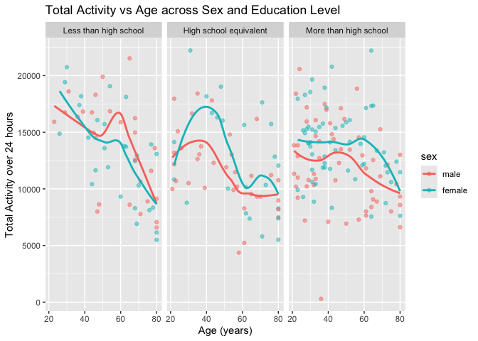

p8105_hw3_mh4589
================
My An Huynh
2024-10-04

The dataset NY NOAA provies information on temperature, snowfall, snow
depth and precipitation everyday starting from 1981 at different weather
stations in NY.

There are 2595176 rows and 7 columns. The most common snowfall is 0.
This is because snow is commonly observed on certain days during winter
months, but not the rest of the year. The next most commonly observed
value is NA, which indicates missing data.

``` r
ny_noaa_df <- ny_noaa |> 
  separate(date, into = c("year", "month", "day"), sep = "-")

snow_mode =
  ny_noaa_df |> 
  count(snow, name = "frequency") |> 
  arrange(desc(frequency)) |> 
  slice(5)
```

Make a two-panel plot showing the average max temperature in January and
in July in each station across years. I divided the temperatures by 10
to convert the units of measurements to degrees Celsius. The mean
temperature in January is much lower than the mean temperature in July
across all stations and across all years. There are a few outliers.

``` r
ny_noaa_df |> 
  drop_na(tmax, tmin) |> 
  filter(month == c("01", "07")) |>
  group_by(id, year) |> 
  mutate(
    tmax = as.numeric(tmax),
    tmin = as.numeric(tmin),
    tmax = tmax/10,
    tmin = tmin/10,
    mean_tmax = mean(tmax, na.rm = TRUE)
  ) |> 
  ggplot(aes(x = id, y = mean_tmax, color = year)) + 
  geom_point(aes(group = year), alpha = 0.5) +
  facet_grid(~month) +
  labs(
    title = "Mean Maximum Temperature Across Stations in January and July",
    x = "Station",
    y = "Mean Maximum Temperature (C)"
) +
  theme_minimal()
```

<!-- -->

Hex plot showing tmax vs tmin

``` r
ny_noaa_df |> 
  ggplot(aes(x = tmin, y = tmax)) +
  geom_hex()
```

<!-- -->

Disrtibution of snow by year

``` r
ny_noaa_df |> 
  filter(snow > 0, snow < 100) |> 
  ggplot(aes(x = snow, y = factor(year))) +
  geom_density_ridges() +
  labs(
    title = "Disribution of snow by year"
  )
```

    ## Picking joint bandwidth of 3.76

<!-- -->

## Problem 2

Loaded, tidied, merged and organized the acceleration and demographic
datasets. Changed education from “1” to less than high school, “2” to
high school equivalent, and “3” to more than high school. Changed sex
from “1” to male and “2” to female. Encoded sex and education as factor
variables. Excluded participants less than 21 years of age using filter,
and those with missing demographic data using drop.na.

``` r
accel_df =
  read_csv("data/nhanes_accel.csv") |> 
  janitor::clean_names()
```

    ## Rows: 250 Columns: 1441
    ## ── Column specification ────────────────────────────────────────────────────────
    ## Delimiter: ","
    ## dbl (1441): SEQN, min1, min2, min3, min4, min5, min6, min7, min8, min9, min1...
    ## 
    ## ℹ Use `spec()` to retrieve the full column specification for this data.
    ## ℹ Specify the column types or set `show_col_types = FALSE` to quiet this message.

``` r
covar_df = 
  read_csv("data/nhanes_covar.csv", skip = 4) |> 
  janitor::clean_names() |> 
  mutate(
    sex = recode(sex, 
                 "1" = "male", 
                 "2" = "female"),
    sex = factor(sex, levels = c("male", "female")),
    education = recode(education,
                       "1" = "Less than high school",
                       "2" = "High school equivalent",
                       "3" = "More than high school"),
    education = factor(education, levels = c("Less than high school", "High school equivalent", "More than high school"))
  )
```

    ## Rows: 250 Columns: 5
    ## ── Column specification ────────────────────────────────────────────────────────
    ## Delimiter: ","
    ## dbl (5): SEQN, sex, age, BMI, education
    ## 
    ## ℹ Use `spec()` to retrieve the full column specification for this data.
    ## ℹ Specify the column types or set `show_col_types = FALSE` to quiet this message.

``` r
nhanes_df = 
  left_join(covar_df, accel_df, by = "seqn") |> 
  filter(age >= 21) |> 
  drop_na(education, bmi, age, sex)
```

Created a reader-friendly table using `kable()` showing the number of
men and women in each education category, and created a density plot
showing the distribution of age for men and women across each education
category.

The table shows that the “more than high school” group had the most
participants (total of 115), while the “less than high school” and “high
school equivalent” groups have 55 and 58, respectively. The ratio
between male and female participants for “less than high school” and
“more than high school” groups were approximately 1:1, whereas the “high
school equivalent” group have a male-to-female ratio of 1.5:1. These
differences may influence the other observed variables, such as total
activity.

The density plot gives more information on the distribution of
participants’ age by sex and education.

For the “less than high school” group, the distribution for male
participants is bimodal, with two peaks around 40-50 and 70-80. The
distribution of female participants is relatively unimodal, with a peak
around ages 70-80. The peaks for both male and female at 70-80 suggest
that there are more participants in this age range for this education
category. There are approximately the same numbers of male and female
participants aged 20-30, and the overall density is lower compared to
other age groups. There are more male participants than there are female
within the age range 30-45, and vice versa for the age range 45 to 80.

For the “high school equivalent” group, the distribution for male
participants is bimodal, with two peaks around ages 30-40 and 60-70. The
distribution for female participants is unimodal and skewed towards
older age ranges (60 or above). There are noticeably fewer female than
male participants within the age range 20-40, and vice versa for the age
range 70-80. The overall distirbution of age is relatively similar to
that of the “less than high school” group.

For the “more than high school” group, the distribution skews towards
younger ages compared to the other two education groups. There are
higher densities of both female and male participants within the age
range 20-40. The density drops more sharply for older ages (60 or above)
compared to the other two education groups.

``` r
nhanes_df |> 
  group_by(education, sex) |> 
  summarize(
    count = n()
  ) |> 
  pivot_wider(
    names_from = education,
    values_from = count
  ) |> 
  knitr::kable(
    caption = "Number of men and women in each education category"
  ) 
```

    ## `summarise()` has grouped output by 'education'. You can override using the
    ## `.groups` argument.

| sex    | Less than high school | High school equivalent | More than high school |
|:-------|----------------------:|-----------------------:|----------------------:|
| male   |                    27 |                     35 |                    56 |
| female |                    28 |                     23 |                    59 |

Number of men and women in each education category

``` r
nhanes_df |> 
  ggplot(aes(x = age, fill = sex)) + 
  geom_density(alpha = 0.5) +
  facet_grid(. ~ education) +
  labs(
    title = "Distribution of Age by Sex and Education",
    x = "Age",
    y = "Density"
  ) 
```

<!-- -->

``` r
  theme_minimal()
```

    ## List of 136
    ##  $ line                            :List of 6
    ##   ..$ colour       : chr "black"
    ##   ..$ linewidth    : num 0.5
    ##   ..$ linetype     : num 1
    ##   ..$ lineend      : chr "butt"
    ##   ..$ arrow        : logi FALSE
    ##   ..$ inherit.blank: logi TRUE
    ##   ..- attr(*, "class")= chr [1:2] "element_line" "element"
    ##  $ rect                            :List of 5
    ##   ..$ fill         : chr "white"
    ##   ..$ colour       : chr "black"
    ##   ..$ linewidth    : num 0.5
    ##   ..$ linetype     : num 1
    ##   ..$ inherit.blank: logi TRUE
    ##   ..- attr(*, "class")= chr [1:2] "element_rect" "element"
    ##  $ text                            :List of 11
    ##   ..$ family       : chr ""
    ##   ..$ face         : chr "plain"
    ##   ..$ colour       : chr "black"
    ##   ..$ size         : num 11
    ##   ..$ hjust        : num 0.5
    ##   ..$ vjust        : num 0.5
    ##   ..$ angle        : num 0
    ##   ..$ lineheight   : num 0.9
    ##   ..$ margin       : 'margin' num [1:4] 0points 0points 0points 0points
    ##   .. ..- attr(*, "unit")= int 8
    ##   ..$ debug        : logi FALSE
    ##   ..$ inherit.blank: logi TRUE
    ##   ..- attr(*, "class")= chr [1:2] "element_text" "element"
    ##  $ title                           : NULL
    ##  $ aspect.ratio                    : NULL
    ##  $ axis.title                      : NULL
    ##  $ axis.title.x                    :List of 11
    ##   ..$ family       : NULL
    ##   ..$ face         : NULL
    ##   ..$ colour       : NULL
    ##   ..$ size         : NULL
    ##   ..$ hjust        : NULL
    ##   ..$ vjust        : num 1
    ##   ..$ angle        : NULL
    ##   ..$ lineheight   : NULL
    ##   ..$ margin       : 'margin' num [1:4] 2.75points 0points 0points 0points
    ##   .. ..- attr(*, "unit")= int 8
    ##   ..$ debug        : NULL
    ##   ..$ inherit.blank: logi TRUE
    ##   ..- attr(*, "class")= chr [1:2] "element_text" "element"
    ##  $ axis.title.x.top                :List of 11
    ##   ..$ family       : NULL
    ##   ..$ face         : NULL
    ##   ..$ colour       : NULL
    ##   ..$ size         : NULL
    ##   ..$ hjust        : NULL
    ##   ..$ vjust        : num 0
    ##   ..$ angle        : NULL
    ##   ..$ lineheight   : NULL
    ##   ..$ margin       : 'margin' num [1:4] 0points 0points 2.75points 0points
    ##   .. ..- attr(*, "unit")= int 8
    ##   ..$ debug        : NULL
    ##   ..$ inherit.blank: logi TRUE
    ##   ..- attr(*, "class")= chr [1:2] "element_text" "element"
    ##  $ axis.title.x.bottom             : NULL
    ##  $ axis.title.y                    :List of 11
    ##   ..$ family       : NULL
    ##   ..$ face         : NULL
    ##   ..$ colour       : NULL
    ##   ..$ size         : NULL
    ##   ..$ hjust        : NULL
    ##   ..$ vjust        : num 1
    ##   ..$ angle        : num 90
    ##   ..$ lineheight   : NULL
    ##   ..$ margin       : 'margin' num [1:4] 0points 2.75points 0points 0points
    ##   .. ..- attr(*, "unit")= int 8
    ##   ..$ debug        : NULL
    ##   ..$ inherit.blank: logi TRUE
    ##   ..- attr(*, "class")= chr [1:2] "element_text" "element"
    ##  $ axis.title.y.left               : NULL
    ##  $ axis.title.y.right              :List of 11
    ##   ..$ family       : NULL
    ##   ..$ face         : NULL
    ##   ..$ colour       : NULL
    ##   ..$ size         : NULL
    ##   ..$ hjust        : NULL
    ##   ..$ vjust        : num 1
    ##   ..$ angle        : num -90
    ##   ..$ lineheight   : NULL
    ##   ..$ margin       : 'margin' num [1:4] 0points 0points 0points 2.75points
    ##   .. ..- attr(*, "unit")= int 8
    ##   ..$ debug        : NULL
    ##   ..$ inherit.blank: logi TRUE
    ##   ..- attr(*, "class")= chr [1:2] "element_text" "element"
    ##  $ axis.text                       :List of 11
    ##   ..$ family       : NULL
    ##   ..$ face         : NULL
    ##   ..$ colour       : chr "grey30"
    ##   ..$ size         : 'rel' num 0.8
    ##   ..$ hjust        : NULL
    ##   ..$ vjust        : NULL
    ##   ..$ angle        : NULL
    ##   ..$ lineheight   : NULL
    ##   ..$ margin       : NULL
    ##   ..$ debug        : NULL
    ##   ..$ inherit.blank: logi TRUE
    ##   ..- attr(*, "class")= chr [1:2] "element_text" "element"
    ##  $ axis.text.x                     :List of 11
    ##   ..$ family       : NULL
    ##   ..$ face         : NULL
    ##   ..$ colour       : NULL
    ##   ..$ size         : NULL
    ##   ..$ hjust        : NULL
    ##   ..$ vjust        : num 1
    ##   ..$ angle        : NULL
    ##   ..$ lineheight   : NULL
    ##   ..$ margin       : 'margin' num [1:4] 2.2points 0points 0points 0points
    ##   .. ..- attr(*, "unit")= int 8
    ##   ..$ debug        : NULL
    ##   ..$ inherit.blank: logi TRUE
    ##   ..- attr(*, "class")= chr [1:2] "element_text" "element"
    ##  $ axis.text.x.top                 :List of 11
    ##   ..$ family       : NULL
    ##   ..$ face         : NULL
    ##   ..$ colour       : NULL
    ##   ..$ size         : NULL
    ##   ..$ hjust        : NULL
    ##   ..$ vjust        : num 0
    ##   ..$ angle        : NULL
    ##   ..$ lineheight   : NULL
    ##   ..$ margin       : 'margin' num [1:4] 0points 0points 2.2points 0points
    ##   .. ..- attr(*, "unit")= int 8
    ##   ..$ debug        : NULL
    ##   ..$ inherit.blank: logi TRUE
    ##   ..- attr(*, "class")= chr [1:2] "element_text" "element"
    ##  $ axis.text.x.bottom              : NULL
    ##  $ axis.text.y                     :List of 11
    ##   ..$ family       : NULL
    ##   ..$ face         : NULL
    ##   ..$ colour       : NULL
    ##   ..$ size         : NULL
    ##   ..$ hjust        : num 1
    ##   ..$ vjust        : NULL
    ##   ..$ angle        : NULL
    ##   ..$ lineheight   : NULL
    ##   ..$ margin       : 'margin' num [1:4] 0points 2.2points 0points 0points
    ##   .. ..- attr(*, "unit")= int 8
    ##   ..$ debug        : NULL
    ##   ..$ inherit.blank: logi TRUE
    ##   ..- attr(*, "class")= chr [1:2] "element_text" "element"
    ##  $ axis.text.y.left                : NULL
    ##  $ axis.text.y.right               :List of 11
    ##   ..$ family       : NULL
    ##   ..$ face         : NULL
    ##   ..$ colour       : NULL
    ##   ..$ size         : NULL
    ##   ..$ hjust        : num 0
    ##   ..$ vjust        : NULL
    ##   ..$ angle        : NULL
    ##   ..$ lineheight   : NULL
    ##   ..$ margin       : 'margin' num [1:4] 0points 0points 0points 2.2points
    ##   .. ..- attr(*, "unit")= int 8
    ##   ..$ debug        : NULL
    ##   ..$ inherit.blank: logi TRUE
    ##   ..- attr(*, "class")= chr [1:2] "element_text" "element"
    ##  $ axis.text.theta                 : NULL
    ##  $ axis.text.r                     :List of 11
    ##   ..$ family       : NULL
    ##   ..$ face         : NULL
    ##   ..$ colour       : NULL
    ##   ..$ size         : NULL
    ##   ..$ hjust        : num 0.5
    ##   ..$ vjust        : NULL
    ##   ..$ angle        : NULL
    ##   ..$ lineheight   : NULL
    ##   ..$ margin       : 'margin' num [1:4] 0points 2.2points 0points 2.2points
    ##   .. ..- attr(*, "unit")= int 8
    ##   ..$ debug        : NULL
    ##   ..$ inherit.blank: logi TRUE
    ##   ..- attr(*, "class")= chr [1:2] "element_text" "element"
    ##  $ axis.ticks                      : list()
    ##   ..- attr(*, "class")= chr [1:2] "element_blank" "element"
    ##  $ axis.ticks.x                    : NULL
    ##  $ axis.ticks.x.top                : NULL
    ##  $ axis.ticks.x.bottom             : NULL
    ##  $ axis.ticks.y                    : NULL
    ##  $ axis.ticks.y.left               : NULL
    ##  $ axis.ticks.y.right              : NULL
    ##  $ axis.ticks.theta                : NULL
    ##  $ axis.ticks.r                    : NULL
    ##  $ axis.minor.ticks.x.top          : NULL
    ##  $ axis.minor.ticks.x.bottom       : NULL
    ##  $ axis.minor.ticks.y.left         : NULL
    ##  $ axis.minor.ticks.y.right        : NULL
    ##  $ axis.minor.ticks.theta          : NULL
    ##  $ axis.minor.ticks.r              : NULL
    ##  $ axis.ticks.length               : 'simpleUnit' num 2.75points
    ##   ..- attr(*, "unit")= int 8
    ##  $ axis.ticks.length.x             : NULL
    ##  $ axis.ticks.length.x.top         : NULL
    ##  $ axis.ticks.length.x.bottom      : NULL
    ##  $ axis.ticks.length.y             : NULL
    ##  $ axis.ticks.length.y.left        : NULL
    ##  $ axis.ticks.length.y.right       : NULL
    ##  $ axis.ticks.length.theta         : NULL
    ##  $ axis.ticks.length.r             : NULL
    ##  $ axis.minor.ticks.length         : 'rel' num 0.75
    ##  $ axis.minor.ticks.length.x       : NULL
    ##  $ axis.minor.ticks.length.x.top   : NULL
    ##  $ axis.minor.ticks.length.x.bottom: NULL
    ##  $ axis.minor.ticks.length.y       : NULL
    ##  $ axis.minor.ticks.length.y.left  : NULL
    ##  $ axis.minor.ticks.length.y.right : NULL
    ##  $ axis.minor.ticks.length.theta   : NULL
    ##  $ axis.minor.ticks.length.r       : NULL
    ##  $ axis.line                       : list()
    ##   ..- attr(*, "class")= chr [1:2] "element_blank" "element"
    ##  $ axis.line.x                     : NULL
    ##  $ axis.line.x.top                 : NULL
    ##  $ axis.line.x.bottom              : NULL
    ##  $ axis.line.y                     : NULL
    ##  $ axis.line.y.left                : NULL
    ##  $ axis.line.y.right               : NULL
    ##  $ axis.line.theta                 : NULL
    ##  $ axis.line.r                     : NULL
    ##  $ legend.background               : list()
    ##   ..- attr(*, "class")= chr [1:2] "element_blank" "element"
    ##  $ legend.margin                   : 'margin' num [1:4] 5.5points 5.5points 5.5points 5.5points
    ##   ..- attr(*, "unit")= int 8
    ##  $ legend.spacing                  : 'simpleUnit' num 11points
    ##   ..- attr(*, "unit")= int 8
    ##  $ legend.spacing.x                : NULL
    ##  $ legend.spacing.y                : NULL
    ##  $ legend.key                      : list()
    ##   ..- attr(*, "class")= chr [1:2] "element_blank" "element"
    ##  $ legend.key.size                 : 'simpleUnit' num 1.2lines
    ##   ..- attr(*, "unit")= int 3
    ##  $ legend.key.height               : NULL
    ##  $ legend.key.width                : NULL
    ##  $ legend.key.spacing              : 'simpleUnit' num 5.5points
    ##   ..- attr(*, "unit")= int 8
    ##  $ legend.key.spacing.x            : NULL
    ##  $ legend.key.spacing.y            : NULL
    ##  $ legend.frame                    : NULL
    ##  $ legend.ticks                    : NULL
    ##  $ legend.ticks.length             : 'rel' num 0.2
    ##  $ legend.axis.line                : NULL
    ##  $ legend.text                     :List of 11
    ##   ..$ family       : NULL
    ##   ..$ face         : NULL
    ##   ..$ colour       : NULL
    ##   ..$ size         : 'rel' num 0.8
    ##   ..$ hjust        : NULL
    ##   ..$ vjust        : NULL
    ##   ..$ angle        : NULL
    ##   ..$ lineheight   : NULL
    ##   ..$ margin       : NULL
    ##   ..$ debug        : NULL
    ##   ..$ inherit.blank: logi TRUE
    ##   ..- attr(*, "class")= chr [1:2] "element_text" "element"
    ##  $ legend.text.position            : NULL
    ##  $ legend.title                    :List of 11
    ##   ..$ family       : NULL
    ##   ..$ face         : NULL
    ##   ..$ colour       : NULL
    ##   ..$ size         : NULL
    ##   ..$ hjust        : num 0
    ##   ..$ vjust        : NULL
    ##   ..$ angle        : NULL
    ##   ..$ lineheight   : NULL
    ##   ..$ margin       : NULL
    ##   ..$ debug        : NULL
    ##   ..$ inherit.blank: logi TRUE
    ##   ..- attr(*, "class")= chr [1:2] "element_text" "element"
    ##  $ legend.title.position           : NULL
    ##  $ legend.position                 : chr "right"
    ##  $ legend.position.inside          : NULL
    ##  $ legend.direction                : NULL
    ##  $ legend.byrow                    : NULL
    ##  $ legend.justification            : chr "center"
    ##  $ legend.justification.top        : NULL
    ##  $ legend.justification.bottom     : NULL
    ##  $ legend.justification.left       : NULL
    ##  $ legend.justification.right      : NULL
    ##  $ legend.justification.inside     : NULL
    ##  $ legend.location                 : NULL
    ##  $ legend.box                      : NULL
    ##  $ legend.box.just                 : NULL
    ##  $ legend.box.margin               : 'margin' num [1:4] 0cm 0cm 0cm 0cm
    ##   ..- attr(*, "unit")= int 1
    ##  $ legend.box.background           : list()
    ##   ..- attr(*, "class")= chr [1:2] "element_blank" "element"
    ##  $ legend.box.spacing              : 'simpleUnit' num 11points
    ##   ..- attr(*, "unit")= int 8
    ##   [list output truncated]
    ##  - attr(*, "class")= chr [1:2] "theme" "gg"
    ##  - attr(*, "complete")= logi TRUE
    ##  - attr(*, "validate")= logi TRUE

Created a new `total_activity` variable that aggregates activity level
across 1440 minutes for each participant. Made a scatter plot of total
activity against age and included a trend line.

The overall trend indicates that activity levels decrease as age
increases for all participants, male and female and across 3 education
groups.

For the “less than high school” group, total activity is highest for
ages around 20 and decline as age increases for both men and women.
There is a sharp increase in activity among male participants around the
age range 55-65, followed by a sharp decrease. There is a slight
increase in activity among female participants around 55-65 as well, but
this change is not as sharp as was observed in the male group, and
followed by a sharp decrease as age increases to 80.

Similar to the distribution of the “less than high school” group, there
is an overall decline in total activity as age increases for the “high
school equivalent” group, but the decline is not as sharp. The
distribution for total activity among female participants is bimodal,
with two peaks indicating increased activity levels among ages 40-50
(denoted by larger peak) and 70-80 (denoted by smaller peak). The
distribution for total activity among male participants only has only
peak that corresponds to the age range 30-40. Total activity stays
constant for male participants aged 60-80. The activity level among
females is overall higher than that among males.

For the “more than high school” group, total activity stays relatively
constant among female participants aged 20-60, followed by a sharp
decrease for ages 60 to 80. The total activity among male participants
peaks around ages 40-50, and decreases for ages 50 to 80. Overall, total
activity among female participants in this group is higher than that
among male participants.

``` r
nhanes_df =
  nhanes_df |> 
  pivot_longer(
    cols = min1:min1440,
    names_to = "minutes",
    values_to = "mims",
    names_prefix = "min"
  ) 

nhanes_df |> 
  group_by(seqn, sex, age, education) |> 
  summarize(
    total_activity = sum(mims)
  ) |> 
  ggplot(aes(x = age, y = total_activity, color = sex))+
  geom_point(alpha = 0.5)+
  geom_smooth(se = FALSE) +
  facet_grid(~education) + 
  labs(
    title = "Total Activity vs Age across Sex and Education Level",
    x = "Age (years)",
    y = "Total Activity over 24 hours"
  )
```

    ## `summarise()` has grouped output by 'seqn', 'sex', 'age'. You can override
    ## using the `.groups` argument.
    ## `geom_smooth()` using method = 'loess' and formula = 'y ~ x'

<!-- -->

Made a three-panel plot that shows the 24-hour activity time courses for
each education level and used color to indicate sex.

The trend in 24-hour activity is overall very similar among three
education groups, with not much variability between males and females;
there is higher activity around 12 am - 6 am, followed by a dip in
activity levels at around 6 am to 3 pm indicating potential rest time,
and activity picks up again from 3 pm to 12 am. The smoothed trend lines
for males and females are quite similar, indicating no significant
differences in the timing of activity throughout the day across the two
sexes and education levels.

For the “less than high school” group, the dip is not as pronounced for
males from around 9 am to 12 pm compared to that of females. This
difference is not as noticeable for the “high school equivalent” group.

Compared to the “less than high school” and “high school equivalent”
groups, the “more than high school” group shows more variability in the
patterns. Even though the smoothed lines look similar to the other two
groups, the data itself shows noticeable sharp peaks around 3 am to 5 am
and smaller sharp peaks from 1 pm to 8 pm for males. This suggests that
some male participants may have varying workout schedules earlier or
later during the day. There is a sharp peak in activity around 12 pm to
3 pm among females, indicating that females are more active around this
time period. The overall variability indicates that participants in this
group may have more diverse daily schedules or engage in a wider range
of activities throughout the day. This variability may also be due to
the fact that there is double the number of participants for this group
than the other two groups, which increases variation.

In conclusion, we may extrapolate that participants with more than a
high school degree engage in varying activities throughout the day, with
potential factors being flexible work hours and schedules, and different
lifestyle habits. The dip in activity level around mid day may reflect
lunch breaks or rest periods and is consistent among three education
groups.

``` r
nhanes_df |> 
  ggplot(aes(x = minutes, y = mims, color = sex)) + 
  geom_line(alpha = .25) +
  facet_grid(.~ education) +
  geom_smooth(aes(group = sex), se = FALSE) + 
  labs(
    title = "24-hour Activity Time Courses for Each Education Level",
    x = "Time Course over 24 hours (Minutes)",
    y = "Activity"
  )
```

    ## `geom_smooth()` using method = 'gam' and formula = 'y ~ s(x, bs = "cs")'

<!-- -->

## Problem 3

Loaded the zip files and joined 4 datasets together.

The joined dataset includes information on 1% of all Citi Bike rides in
NYC with a total duration less than 4 hours in each of four months
(January 2020, July 2020, January 2024 and July 2024). There are 9
variables and 99485 observations. The important variables in this
dataset are ride IDs, types of ride (classic bike or electric bike),
days of the week that the bikes were rented on (Monday through Sunday),
duration of rental (in minutes), pickup and drop off locations, and
types of membership (Citi Bike member or casual). After checking for NA,
there are 232 rows with at least 1 NA value, and most of the NA values
are within the `end_station_name` column. Since this does not seem to
affect the next steps of data processing, I did not remove these NA
values.

``` r
jan_20_df = 
  read_csv("data/Jan 2020 Citi.csv") |>
  janitor::clean_names() |> 
  mutate(
    month = "January",
    year = "2020"
  )
```

    ## Rows: 12420 Columns: 7
    ## ── Column specification ────────────────────────────────────────────────────────
    ## Delimiter: ","
    ## chr (6): ride_id, rideable_type, weekdays, start_station_name, end_station_n...
    ## dbl (1): duration
    ## 
    ## ℹ Use `spec()` to retrieve the full column specification for this data.
    ## ℹ Specify the column types or set `show_col_types = FALSE` to quiet this message.

``` r
jan_24_df = 
  read_csv("data/Jan 2024 Citi.csv") |> 
  janitor::clean_names() |> 
   mutate(
    month = "January",
    year = "2024"
  )
```

    ## Rows: 18861 Columns: 7
    ## ── Column specification ────────────────────────────────────────────────────────
    ## Delimiter: ","
    ## chr (6): ride_id, rideable_type, weekdays, start_station_name, end_station_n...
    ## dbl (1): duration
    ## 
    ## ℹ Use `spec()` to retrieve the full column specification for this data.
    ## ℹ Specify the column types or set `show_col_types = FALSE` to quiet this message.

``` r
jul_20_df = 
  read_csv("data/July 2020 Citi.csv") |> 
  janitor::clean_names() |> 
   mutate(
    month = "July",
    year = "2020"
  )
```

    ## Rows: 21048 Columns: 7
    ## ── Column specification ────────────────────────────────────────────────────────
    ## Delimiter: ","
    ## chr (6): ride_id, rideable_type, weekdays, start_station_name, end_station_n...
    ## dbl (1): duration
    ## 
    ## ℹ Use `spec()` to retrieve the full column specification for this data.
    ## ℹ Specify the column types or set `show_col_types = FALSE` to quiet this message.

``` r
jul_24_df = 
  read_csv("data/July 2024 Citi.csv") |> 
  janitor::clean_names() |> 
   mutate(
    month = "July",
    year = "2024"
  )
```

    ## Rows: 47156 Columns: 7
    ## ── Column specification ────────────────────────────────────────────────────────
    ## Delimiter: ","
    ## chr (6): ride_id, rideable_type, weekdays, start_station_name, end_station_n...
    ## dbl (1): duration
    ## 
    ## ℹ Use `spec()` to retrieve the full column specification for this data.
    ## ℹ Specify the column types or set `show_col_types = FALSE` to quiet this message.

``` r
citi_df = 
  bind_rows(jan_20_df, jan_24_df, jul_20_df, jul_24_df)
  
citi_df[!complete.cases(citi_df), ]
```

    ## # A tibble: 232 × 9
    ##    ride_id   rideable_type weekdays duration start_station_name end_station_name
    ##    <chr>     <chr>         <chr>       <dbl> <chr>              <chr>           
    ##  1 12E6A400… classic_bike  Friday      11.8  W 26 St & 10 Ave   <NA>            
    ##  2 E19798CD… classic_bike  Thursday    24.2  E 11 St & 2 Ave    <NA>            
    ##  3 C9E7F443… electric_bike Thursday     8.21 <NA>               <NA>            
    ##  4 771F4640… classic_bike  Sunday      11.8  Halsey St & Broad… <NA>            
    ##  5 4EBF8F01… classic_bike  Monday       9.18 W 54 St & 9 Ave    <NA>            
    ##  6 499B2519… classic_bike  Sunday       7.24 W 38 St & 8 Ave    <NA>            
    ##  7 DE33B141… classic_bike  Monday       7.17 E 47 St & Park Ave <NA>            
    ##  8 AF1944E7… electric_bike Thursday    32.3  <NA>               <NA>            
    ##  9 FBC5DBEA… classic_bike  Friday     117.   W 20 St & 11 Ave   <NA>            
    ## 10 8BD02AC2… classic_bike  Friday      13.2  W 11 St & 6 Ave    <NA>            
    ## # ℹ 222 more rows
    ## # ℹ 3 more variables: member_casual <chr>, month <chr>, year <chr>

Created a reader-friendly table showing the total number of rides in
each combination of year and month separating casual riders and Citi
Bike members.

The results show that there are more bikes being rented in July compared
to January across both 2020 and 2024, regardless of membership type.
There are more bikes being rented in 2024 compared to 2020. Overall,
there are more members renting CitiBike than non-members (casual).

``` r
citi_df |> 
  group_by(year, month, member_casual) |> 
  summarize(
    count = n()
  ) |> 
  pivot_wider(
    names_from = member_casual,
    values_from = count
  ) |> 
  knitr::kable()
```

    ## `summarise()` has grouped output by 'year', 'month'. You can override using the
    ## `.groups` argument.

| year | month   | casual | member |
|:-----|:--------|-------:|-------:|
| 2020 | January |    984 |  11436 |
| 2020 | July    |   5637 |  15411 |
| 2024 | January |   2108 |  16753 |
| 2024 | July    |  10894 |  36262 |

Crete a table showing 5 most popular starting stations in July 2024,
including the number of rides for each station.

``` r
 citi_df |> 
  filter(month == "July", year == "2024", .keep_all = TRUE) |> 
  group_by(start_station_name) |> 
  summarize(numer_of_rides = n()) |> 
  mutate(
    start_station_rank = min_rank(desc(numer_of_rides))
  ) |> 
  arrange(start_station_rank) |>
  select(-start_station_rank) |> 
  head(5) |> 
  knitr::kable()
```

| start_station_name       | numer_of_rides |
|:-------------------------|---------------:|
| Pier 61 at Chelsea Piers |            163 |
| University Pl & E 14 St  |            155 |
| W 21 St & 6 Ave          |            152 |
| West St & Chambers St    |            150 |
| W 31 St & 7 Ave          |            146 |

Made a plot that investigates the effects of day of the week, month, and
year on median ride duration. Changed the angle of x-axis titles for
easier visualization.

In terms of seasonal trends, the median duration is consistently lower
across all weekdays in January compared to July. This indicates that
bike rental durations tend to be shorter in winter (January) compared to
summer (July), which is likely due to the colder weather and/or less
favorable biking conditions in January.

In terms of weekly patterns, there is an overall increase in median
duration towards the weekend, peaking on Saturday and either plateau or
dip on Sunday. This pattern is observable in all four plots. In January,
there is a slight increase in median ride duration but not too
significant, with the increase being more observable in 2020 than 2024.
In July, the median duration is higher compared to January, with a more
pronounced increase towards the weekend, peaking on Saturday in both
2020 and 2024. There is a sharper increase in median ride duration
during the weekend in July 2020 compared to July 2024.

Overall, the plot highlights seasonal and weekly variations in bike
rental behavior, with longer rental durations in summer and on weekends.

``` r
citi_df |> 
  group_by(weekdays, month, year) |> 
  summarize(
    median_duration = median(duration, na.rm = TRUE),
    .group = "drop"
  ) |> 
  mutate(
    weekdays = factor(weekdays, levels = c("Monday", "Tuesday", "Wednesday", "Thursday", "Friday", "Saturday", "Sunday"))
  ) |> 
  ggplot(aes(x = weekdays, y = median_duration, group = year, color = month)) +
  geom_line(size = 1) +  
  facet_grid(year ~ month) +
  labs(
    title = "Median Bike Rental Duration by Weekday across January and July of 2020 and 2024", 
    x = "Weekdays", 
    y = "Median Duration",
    caption = "Median Bike Rental Duration by Weekday across January and July of 2020 and 2024") +
  theme_minimal() +
  theme(axis.text.x = element_text(angle = 45, vjust = 1, hjust = 1))
```

    ## `summarise()` has grouped output by 'weekdays', 'month'. You can override using
    ## the `.groups` argument.

    ## Warning: Using `size` aesthetic for lines was deprecated in ggplot2 3.4.0.
    ## ℹ Please use `linewidth` instead.
    ## This warning is displayed once every 8 hours.
    ## Call `lifecycle::last_lifecycle_warnings()` to see where this warning was
    ## generated.

<!-- -->

Made a violin plot that shows the impact of month, membership status,
and bike type on the distribution of ride duration. The plot shows the
distribution of ride durations for different bike types, membership
statuses (casual vs. member), and months (January and July).

Overall, casual riders generally have a wider distribution of ride
durations compared to members, which suggests that bike members tend to
rent for shorter trips while casual riders tend to rent for varying
durations. This trend is consistent for both electric and classic bikes,
and across the four months.

For casual riders, classic bikes have a broader range of ride durations,
while electric bikes show a higher density around shorter rides. This
could suggest that electric bikes are used more frequently for shorter,
convenience trips, or it could be because there are not as many electric
bikes as there are classic bikes. T

For members, the distributions of ride durations stratified by bike type
are relatively similar, with there being a slightly wider range of
duration for classic bikes than electric bikes. This difference is not
as observable compared to that for casual members.

In terms of seasonal variation (month and year), there is a slightly
higher density of longer rides in July compared to January, particularly
for casual riders. This is likely due to better weather conditions. In
January, ride durations for both bike types and membership statuses
appear shorter, which may be influenced by colder weather. Furthermore,
the distribution of ride durations for electric bikes has a wider range
in 2024 compared to 2020, possibly due to there being more electric
bikes in 2024. This is observable for both casual and members, and
across the two seasons.

``` r
citi_df |> 
  ggplot(aes(x = rideable_type, y = duration)) +
  geom_violin() +
  facet_grid(month ~ member_casual) +
  labs(
    title = "Distribution of Ride Duration Based on Bike Type, Membership Status and Month",
    x = "Type of Bike",
    y = "Ride Duration (minutes)"
  ) +
  theme_minimal()
```

<!-- -->
